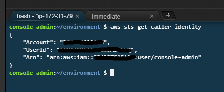
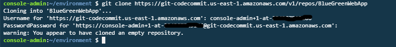
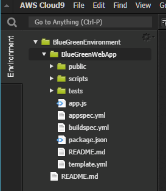
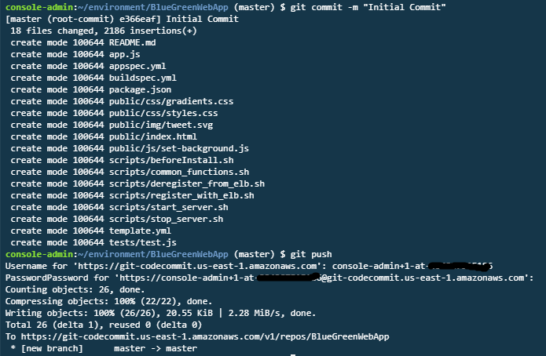
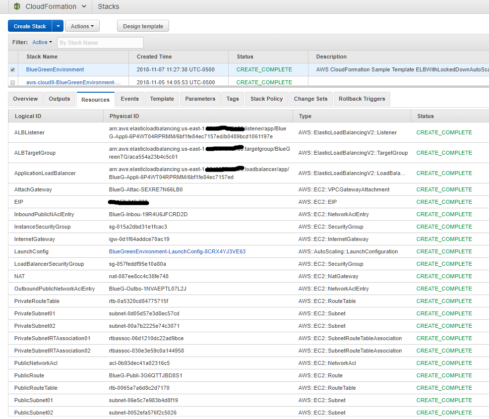
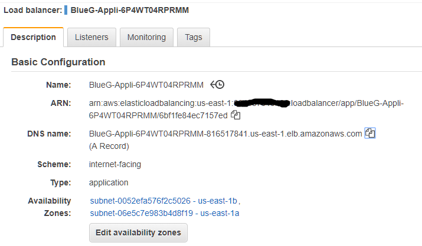
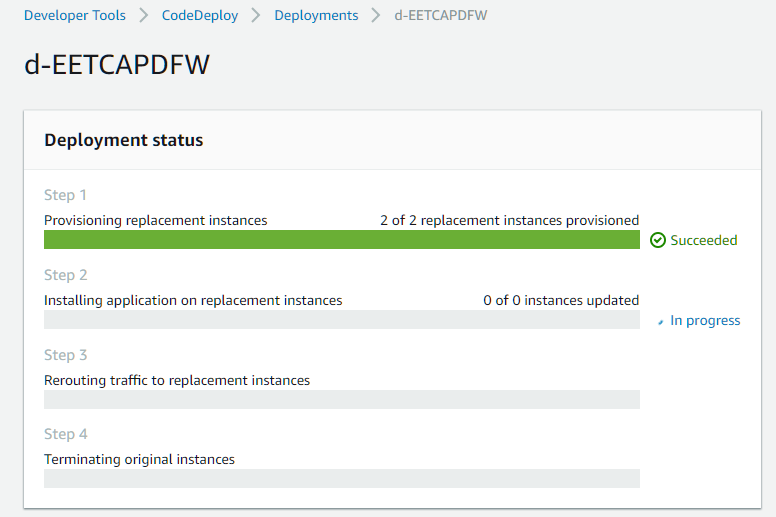

# Step by Step Instructions

## Create Cloud9 environment

AWS Cloud9 is a cloud-based integrated development environment (IDE) that lets you write, run, and debug your code with just a browser. It includes a code editor, debugger, and terminal. Cloud9 comes prepackaged with essential tools for popular programming languages, including JavaScript, Python, PHP, and more, so you don’t need to install files or configure your development machine to start new projects. Since your Cloud9 IDE is cloud-based, you can work on your projects from your office, home, or anywhere using an internet-connected machine. Cloud9 also provides a seamless experience for developing serverless applications enabling you to easily define resources, debug, and switch between local and remote execution of serverless applications. With Cloud9, you can quickly share your development environment with your team, enabling you to pair program and track each other's inputs in real time.

Note: For this lab you will need to use an IAM user and not a federated user account or root account. See the [Prerequisites](./Prerequisites.md)

1. Go to the AWS Management Console, click **Services** then select **Cloud9** under Developer Tools.
2. Click **Create environment**.
3. Enter `BlueGreenEnvironment` into **Name** and optionally provide a **Description**.
4. Click **Next step**.
5. You may leave **Environment settings** at their defaults of launching a new **t2.micro** EC2 instance which will be paused after **30 minutes** of inactivity.
6. Click **Next step**.
7. Review the environment settings and click **Create environment**. It will take several minutes for your environment to be provisioned and prepared.
8. Once ready, your IDE will open to a welcome screen. Below that, you should see a terminal prompt similar to:  You can run AWS CLI commands in here just like you would on your local computer. Verify that your user is logged in by running `aws sts get-caller-identity`.



We will be using Cloud9 IDE for our development. 

## Create Code Commit Credentials

1. Choose an IAM user with sufficient privileges.  For simplicity, you can assign full permisssion to this or a new IAM user.
2. On the user details page in IAM console, choose the **Security Credentials** tab, and in **HTTPS Git credentials for AWS CodeCommit**, choose **Generate**. 


Note: Make Note of the Git HTTP credentials handy. It will be used for cloning and pushing changes to Repo. Also, You can find detail instruction on how to configure HTTPS Git Credential [here](https://docs.aws.amazon.com/codecommit/latest/userguide/setting-up-gc.html)

## Create an AWS CodeCommit Repository

1. Open the AWS CodeCommit console at <https://console.aws.amazon.com/codecommit>.
2. In the region selector, choose the region where you will create the repository. For more information, see [Regions and Git Connection Endpoints](http://docs.aws.amazon.com/codecommit/latest/userguide/regions.html).
3. On the Welcome page, choose Get Started Now. (If a **_Dashboard_** page appears instead, choose **_Create repository_**.)
4. On the **Create repository** page, in the **Repository name** box, type **_BlueGreenWebApp_**.
5. In the **Description** box, type **_BlueGreenWebApp repository_**.
6. Click **Create repository** to create an empty AWS CodeCommit repository named **_BlueGreenWebApp_**.
7. On the successful screen of creating **_BlueGreenWebApp_**, review Connection steps. In the step 3, click Copy to copy the Clone command.
8. Go to your Cloud9 IDE you created in the previous step.  In the terminal prompt paste clone command you previouly copied. Enter Username and Password of your Git Credential.



9. Configure Git user in Cloud9 environment.

```console
user:~/environment $ git config --global user.email you@example.com
user:~/environment $ git config --global user.name "Your Name"
user:~/environment $ cd BlueGreenWebApp
user:~/environment $ git config credential.helper store
```

10. Inside BlueGreenWebApp folder, download the Sample Web App Archive by running the following command from IDE terminal and unzip the archvie.

```console
user:~/environment $ wget https://github.com/aws-samples/aws-cicd-bluegreen/raw/master/WebApp.zip
user:~/environment $ unzip WebApp.zip
user:~/environment $ rm WebApp.zip
```
Your IDE environment should look like this.



11. Stage your change by running **_git add_**. You can use **_git status_** to review the change.

```console
user:~/environment/BlueGreenEnvironment/ $ git add .
user:~/environment/BlueGreenEnvironment/ $ git status
```

12.  Commit your change by running **_git commit_** to commit the change to the local repository then run **_git push_** to push your commit the default remote name Git uses for your AWS CodeCommit repository (origin). Enter your git credential.

```console
user:~/environment/BlueGreenEnvironment/ $ git commit -m "Initial Commit"
user:~/environment/BlueGreenEnvironment/ $ git push
```


**_💡 Tip_** After you have pushed files to your AWS CodeCommit repository, you can use the AWS CodeCommit console to view the contents. For more information, see [Browse the Contents of a Repository](http://docs.aws.amazon.com/codecommit/latest/userguide/how-to-browse.html).

## Create Infrastructure

In this step, we will be using CloudFormation template to create infrstructure used for this lab.  Review template.yml.

1. In Cloud9, create CloudFormation stack by running this command. If the command execute with no issues, you should see the StackId return back.

```console
user:~/environment/BlueGreenEnvironment/ $ aws cloudformation create-stack --stack-name BlueGreenEnvironment --template-body file://template.yml --capabilities CAPABILITY_IAM
```
**_💡 Tip_** After the stack creation start, you can use the AWS CloudFormation console to view its progress.



2. Go to EC2 Console then review AutoScaling, Target Group and Load balancers that you just created.  Note the DNS name of your ALB and browse it in your favorite browser.



## Configure CodeBuild

AWS CodeBuild is a fully managed continuous integration service that compiles source code, runs tests, and produces software packages that are ready to deploy. With CodeBuild, you don’t need to provision, manage, and scale your own build servers. CodeBuild scales continuously and processes multiple builds concurrently, so your builds are not left waiting in a queue. You can get started quickly by using prepackaged build environments, or you can create custom build environments that use your own build tools. With CodeBuild, you are charged by the minute for the compute resources you use.

1. Go to CodeBuild Console and click Create build project. Enter your build project information.

**_Project configuration_**

**Project Name:** BlueGreenWebAppBuild  
**Description:** NodeJS WebApp build

**_Source_**

**Source provider:** AWS CodeCommit  
**Repository:** BlueGreenWebApp   _Note:_ this is your source reporsitory that you have created earlier.

**_Environment_**

In this step, we configure the build environment.

**Environment image:** Managed image  
**Operating system:** Ubuntu  
**Runtime:** Node.js  
**Runtime version:** aws/codebuild/nodejs:10.1.0  
**Image version:** Always use the latest image for this runtime version  
**Service role:** New service role  
**Role name:** codebuild-BlueGreenWebAppBuild-service-role  (Automatically filled)  

**_Buildspec_**

**Build specifications:** Use a buildspec file  
**Buildspec name:** empty   _Note:_ We will be using buildspec.yml which is in the project. Because we are using defualt name, we can leave this field empty.

**_Artifacts_**

**Type:** Amazon S3  Note: We will store build output in S3 bucket.  
**Bucket Name:** build-artifact-bluegreenbucket-us-east-1   Note: This bucket was created with CloudFormation template.  
**Name:** BlueGreenWebAppBuild.zip  
**Artifacts packaging:** Zip  

Click **Create build project**

2. In your Build Project, click **Start build**. Leave everything with defualt value, click **Start build**
3. Observe the build process and logs. When completed, click **View artifacts** link in the Build status section which should take you to the build output zip file in your build artifact S3 bucket. 
4. Congratulations! You succesfully made your first build.

## Configure CodeDeploy

AWS CodeDeploy is a fully managed deployment service that automates software deployments to a variety of compute services such as Amazon EC2, AWS Lambda, and your on-premises servers. AWS CodeDeploy makes it easier for you to rapidly release new features, helps you avoid downtime during application deployment, and handles the complexity of updating your applications. You can use AWS CodeDeploy to automate software deployments, eliminating the need for error-prone manual operations. The service scales to match your deployment needs, from a single Lambda function to thousands of EC2 instances.

1. Go to CodeDeploy Console, click **Create application**. Enter Application configuration and click **Create application**

**Application name:** BlueGreenWebApp  
**Compute platform:** EC2/On-premises  

2. In your CodeDeploy Application, BlueGreenWebApp, on Deployment groups tab, click **Create Deployment group**. Configure the deployment as follow:

**_Deployment group name_**

**Enter a deployment group name:** BlueGreenWebApp_DeploymentGroup
**Service role:** BlueGreenEnvironment-DeployTrustRole-xxxxxxxx    Note: This role was created as a part of CloudFormation.

**_Deployment type_**

Choose how to deploy your application: Blue/green

**_Environment configuration_**

**Specify the Amazon EC2 Auto Scaling groups or Amazon EC2 instances where the current application revision is deployed:** Automatically copy Amazon EC2 Auto Scaling group  
**Choose the Amazon EC2 Auto Scaling group where the current application revision is deployed:** BlueGreenASGroup  _Note:_ This AS was created as a part of CloudFormation.

**_Deployment settings_**

**Choose whether traffic reroutes to the replacement environment immediately or waits for you to start the rerouting process manually:** Reroute traffic immediately  
**Choose whether instances in the original environment are terminated after the deployment is succeeds, and how long to wait before termination:** Terminate the original instances in the deployment group: 5 Minutes  
**Deployment configuration:** CodeDeployDefault.AllAtOnce  

**_Load balancer_**

**Application Load Balancer or Network Load Balancer**
**Choose a load balancer:** BlueGreenTG   _Note:_ This role was created as a part of CloudFormation.  

Click **Create deployment group**

3. Under the deployment group, click **Create deployment**.  Configure the deployment as followed:

**_Deployment settings_**

**Deployment group:** BlueGreenWebApp_DeploymentGroup  
**Revision type:** My application is stored in Amazon S3  
**Revision location:** s3://build-artifact-bluegreenbucket-us-east-1/BlueGreenWebAppBuild.zip   Note: This is the location of the build artifact from your CodeBuild project.  
**Revision file type:** .zip  
Leave everything as the default value.

Click **Create deployment**

4. Under the deployment, observe Deployment status.



## Create CICD with CodePipeline

AWS CodePipeline is a fully managed continuous delivery service that helps you automate your release pipelines for fast and reliable application and infrastructure updates. CodePipeline automates the build, test, and deploy phases of your release process every time there is a code change, based on the release model you define. This enables you to rapidly and reliably deliver features and updates. You can easily integrate AWS CodePipeline with third-party services such as GitHub or with your own custom plugin. With AWS CodePipeline, you only pay for what you use. There are no upfront fees or long-term commitments.

You are going to configure a CodePipleline to use CodeBuild and CodeDeploy previously created.

1. Go to CodePipeline Console and click **Create Pipeline**.  Configure your Pipeline as followed:

**Pipeline name:** BlueGreenWebApp_Pipeline  
**Service role:** New service role  
**Role name:** AWSCodePipelineServiceRole-us-east-1-BlueGreenWebApp_Pipeline (Automatically filled)  
Enable **Allow AWS CodePipeline to create a service role so it can be used with this new pipeline**  
**Artifact Store:** Default location  

**_Source_**

**Source provider:** AWS CodeCommit

**_AWS CodeCommit_**

**Choose a repository:** BlueGreenWebApp  
**Branch name:** master  
**Change detection options:** Amazon CloudWatch Events(recommended)  

**_Build_**

**Build provider:** AWS CodeBuild

**_AWS CodeBuild_**

**Project name:** BlueGreenWebAppBuild  

**_Deploy_**

**Deploy provider:** AWS CodeDeploy  

**_AWS CodeDeploy_**

**Application name:** BlueGreenWebApp  
**Deployment group:** BlueGreenWebApp_DeploymentGroup  

Click **Next** and **Create pipeline**.

2. Observe your existing commit going through CodePipeline.  

## Deploy your new code

1. Go back to your Cloud9 IDE.
2. Navigate to BlueGreenWebApp and public folder. Open index.html.
3. Make a change to the file and save.

```html
        <div class="message">
            <a class="twitter-link" href="http://twitter.com/home/?status=I%20created%20a%20project%20with%20AWS%20CodeStar!%20%23AWS%20%23AWSCodeStar%20https%3A%2F%2Faws.amazon.com%2Fcodestar"></a>
            <div class="text">
                <h1>Congratulations!</h1>
                <h2>You just created a Node.js web application V3 from re:invent!</h2>
            </div>
        </div>
```

4. Commit the change and push to the remote repository.

```console
user:~/environment/BlueGreenEnvironment/ $ git add .
user:~/environment/BlueGreenEnvironment/ $ git commit -m "Changes from re:invent"
user:~/environment/BlueGreenEnvironment/ $ git push
```

5. Go back to CodePipeline Console and observe the progress.
6. Once completed, browse to your ALB endpoint.

**Congratulations! You have completed the lab.**

## Clean up Instruction

1. Go to EC2 Console and navigate to Auto Scaling Groups. Select CodeDeploy_dev314_d-XXXXXXXXX, click Actions and select Delete.
2. Go to CloudFormation console, select bgcicd or the stackname that you created. Click Actions and select Delete Stack.
3. Go to CodeBuild, CodeDeploy and CodePipeline console.  Delete the resource that you have created.
4. Go to IAM Console and delete CodeDeploy role, CodePipeline roles and CodePipeline Policies. Search for BuleGreenWebApp.
